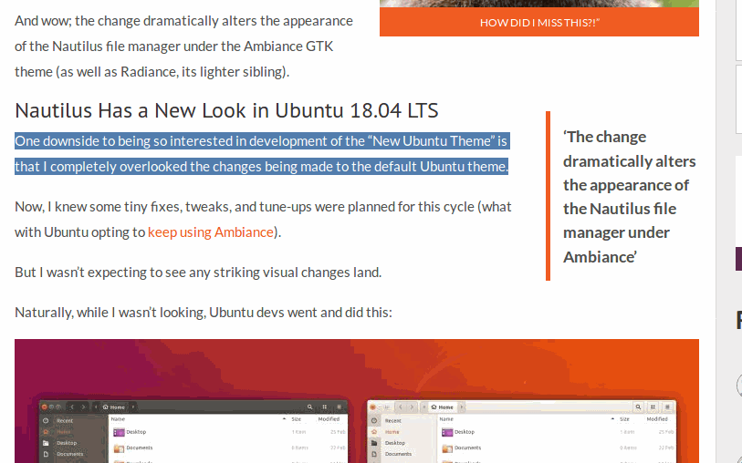

# Translate from any language to specified language.
 

Script that uses shell-translation script for translate from any language to specicied language.



## Installation

Ubuntu:

```sh
sudo apt-get install python-pip
sudo pip install ansi2html
sudo apt-get install xdotool xsel xclip zenity
```
```sh
wget https://raw.githubusercontent.com/soimort/translate-shell/gh-pages/trans
```
```sh
chmod +x trans
chmod +x englishtospanish
chmod +x spanishtoenglish
```
```sh
sudo mv trans /usr/local/bin
sudo mv englishtospanish /usr/local/bin
sudo mv spanishtoenglish /usr/local/bin
```
```sh
Go to system settings -> Keyboard -> Shortcuts -> Add a custom shortcut and assign a key to it.
```
## Usage example

Select a piece of text and apply the shortcut that you have assigned to script for translate the selected text.
By default translator is set to deepL engine, you can modify script and change it.
## Release History

* 0.1
    * First Release.

## Meta

César R. Cid Méndez – [@YourTwitter](https://twitter.com/skypce) – skypce@gmail.com
Credits to https://github.com/soimort/translate-shell by his awesome translation script.
Distributed under the GPL license. See ``LICENSE`` for more information.

[https://github.com/skypce/secure-passwords-script](https://github.com/skypce/secure-passwords-script)

